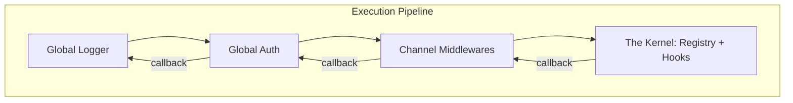

# Architecture Proposal: Onion Execution Layer

## 1. Motivation
The current execution layer in `@synnel/server` uses a simple sequential middleware pattern:
`Middleware A -> Middleware B -> Internal Handler`

### Limitations:
- **No Post-processing**: Middleware cannot easily execute code *after* the handler finishes (e.g., measuring response time or logging final status).
- **Inflexible error handling**: Errors are caught at the top level, making it hard for middleware to provide localized error recovery or transformations.
- **Disconnected Scopes**: It is difficult to compose global server logic with specific channel logic cleanly.

## 2. Technical Design: The Onion Pattern
We are adopting a **Recursive Composition (Onion)** pattern, popularized by frameworks like Koa.js.

### How it Works:
Each middleware is a function that receives a `context` and a `next()` function.
1. **Descent**: Middleware runs its "pre-logic" (e.g., auth check).
2. **The `next()` Call**: It calls `await next()` to hand control to the next layer.
3. **The Kernel**: The innermost layer is the framework's core action (Registry update, Hook trigger).
4. **Ascending**: Once `next()` resolves, control flows back up. Middleware runs its "post-logic" (e.g., logging duration).

### Mermaid Visualization:


## 3. Key Improvements

### A. Total Lifecycle Control
Middlewares now have "Surrounding" control.
- **Before**: "Am I authorized?"
- **After**: "The handler took 5ms and returned Success. I will log this."

### B. Channel-Scoped Middleware
Instead of checking `if (ctx.channel === 'X')` in global middleware, channels now have their own `.use()` method.
- **Scoped Security**: Add unique authorization rules per room.
- **Optimized Performance**: Small, specific middlewares only run for relevant traffic.

### C. Enhanced Context Shared state
Introducing `ctx.state`, a standard object for passing data between layers.
- Auth middleware attaches `ctx.state.user`.
- Downstream logic uses `ctx.state.user` without re-verifying tokens.

## 4. Implementation Map
| File | Change Description |
| :--- | :--- |
| `types/middleware.ts` | Update `IMiddleware` signature to support `next()`. Add `state` to context. |
| `middleware-manager.ts` | Implement the `compose` algorithm to build the onion from an array of functions. |
| `channel-ref.ts` | Add `use()` method and store channel-specific middleware arrays. |
| `synnel-server.ts` | Refactor the transport handlers to trigger the new unified pipeline. |

## 5. Cleanup & Redundancy
By moving to a unified Onion pipeline, several legacy methods become redundant and should be deprecated or removed:

- **[DELETE] `authorize()`**: Authorization logic is now handled by middleware. This removes the "special case" handler and makes permissions just another layer of the onion.
- **[DEPRECATE] `onMessage()` (Global)**: While useful for quick debugging, global message handling is better implemented as a Root Middleware. This ensures that global message handlers follow the same lifecycle rules (ordering, timing, error handling) as everything else.

## 6. Type-Safe State Management
To ensure technical excellence, the `MiddlewareContext` will use TypeScript generics to allow developers to define their state shape:

```ts
interface MyState {
  user: UserProfile;
  authenticated: boolean;
}

server.use<MyState>(async (ctx, next) => {
  ctx.state.user = { id: '1' }; // Type-checked!
  await next();
});
```

## 7. Summary of Impact
This refactor transitions `@synnel/server` from a "Collection of Handlers" to a "First-Class Framework." It provides the technical foundation for robust plugins, better observability, and complex authorization models.
