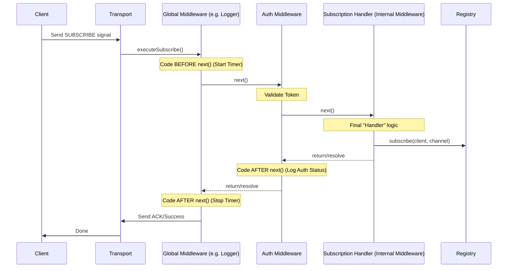

# Proper Execution Layer for @synnel/server

Refactor the server execution layer to adopt a modern **Onion Middleware Pattern** (similar to Koa.js). This will allow middleware to wrap handlers, perform actions after the handler completes, and provide a unified pipeline for all server actions.

## User Review Required

> [!IMPORTANT]
> This is a significant architectural change. Existing middlewares will need to be updated to support the `next()` callback if they want to control post-execution flow, although we can provide a compatibility layer if needed.

## Proposed Changes

### Core Strategy: Onion Pattern
We will transition from:
`M1 -> M2 -> M3 -> [Handler]`
To:
`M1 { M2 { M3 { [Handler] } } }`

This enables:
1. **Logging/Metrics**: Middleware can measure execution time easily.
2. **Post-processing**: Middleware can modify responses or take actions after the handler.
3. **Unified pipeline**: Everything (auth, validation, routing, handler) becomes a middleware.

---

### [Component] Middleware System

#### [MODIFY] [middleware.ts](file:///Users/mehedi/bridgx/Synnel/packages/server/src/types/middleware.ts)
- Add `NextFunction` type: `export type NextFunction = () => Promise<void>`.
- Update `IMiddlewareContext` to include `state: S` and use generics: `IMiddlewareContext<S = Record<string, any>>`.
- Update `IMiddleware` signature: `export type IMiddleware<S = any> = (context: IMiddlewareContext<S>, next: NextFunction) => Promise<void>`.

#### [MODIFY] [factories.ts](file:///Users/mehedi/bridgx/Synnel/packages/server/src/middleware/factories.ts)
- Refactor all factory functions (`createAuthMiddleware`, `createLoggingMiddleware`, etc.) to support the new signature.
- **Crucial**: Every middleware MUST call `await next()` to continue the chain.
- Example Refactor (Logging):
  ```ts
  return async (context, next) => {
    // PRE-logic
    const start = Date.now();
    await next(); // Pass control down
    // POST-logic
    console.log(`Duration: ${Date.now() - start}ms`);
  }
  ```

#### [MODIFY] [middleware-manager.ts](file:///Users/mehedi/bridgx/Synnel/packages/server/src/middleware/middleware-manager.ts)
- Implement `compose` utility to chain middlewares.
- Update `executeMiddlewares` to support the onion flow.

---

### [Component] Channel System

#### [MODIFY] [channel-ref.ts](file:///Users/mehedi/bridgx/Synnel/packages/server/src/channel/channel-ref.ts)
- Add `use(middleware: IMiddleware)` to `ChannelRef`.
- These middlewares will be automatically included in the execution pipeline when the `ctx.channel` matches the channel's name.

- Update the middleware execution to fetch both global and channel-specific middlewares before forming the onion chain.

---

### [Component] Cleanup & Deprecation

#### [DELETE] [synnel-server.ts](file:///Users/mehedi/bridgx/Synnel/packages/server/src/server/synnel-server.ts)
- Remove `authorize()` method and `authorizationHandler` state.
- Remove authorization check from `setupTransportHandlers`.
- Implementation: Provide a warning or basic compatibility layer if absolutely necessary, but preferably remove.

#### [DEPRECATE] [synnel-server.ts](file:///Users/mehedi/bridgx/Synnel/packages/server/src/server/synnel-server.ts)
- Mark `onMessage()` as deprecated. 
- Internal implementation: Move global message handler logic into a default hidden root middleware.

---

## Lifecycle Hook Integration (onSubscribe, onUnsubscribe)

The existing `onSubscribe` and `onUnsubscribe` hooks in `ChannelRef` will remain as **Kernel Actions**. 

1. **Onion Layers**: Global and Channel middlewares run first.
2. **The Kernel**: After all middlewares call `next()`, the framework performs:
    - Registry update (adding/removing client).
    - Triggering `onSubscribe`/`onUnsubscribe` listeners.
3. **Ascending**: Control returns back through the middleware stack.

This ensures that any middleware can **block** a subscription by not calling `next()`, and can also see the result of the subscription handlers during the ascending phase.

---

## Examples

### 1. Request Timing Middleware
Measure how long each message takes to process including all downstream middleware and the handler.

```ts
server.use(async (ctx, next) => {
  const start = Date.now();
  await next(); // Execute the rest of the chain
  const duration = Date.now() - start;
  console.log(`[${ctx.action}] Processed in ${duration}ms`);
});
```

### 2. Error Boundary & Transformation
Catch errors from any downstream middleware or the handler and format them before they reach the transport.

```ts
server.use(async (ctx, next) => {
  try {
    await next();
  } catch (err) {
    console.error('Captured error in middleware:', err);
    // You can even modify the context to send a custom error message
    ctx.reject('Internal server error processed by boundary');
  }
});
```

### 3. State Decoration
Pass data between middlewares efficiently.

```ts
// Middleware A: Auth
server.use(async (ctx, next) => {
  ctx.state.user = { id: '123', roles: ['admin'] };
  await next();
});

// Middleware B: Authorization
server.use(async (ctx, next) => {
  if (!ctx.state.user.roles.includes('admin')) {
    return ctx.reject('Unauthorized');
  }
  await next();
});
```

### 4. Channel-Specific: Room Password Protection
Logic that only applies to a specific "private-room" channel.

```ts
// Create a private channel
const privateRoom = server.createMulticast('top-secret');

// Add middleware ONLY to this channel
privateRoom.use(async (ctx, next) => {
  const password = ctx.message?.data?.password;
  
  if (ctx.action === 'subscribe' && password !== '12345') {
    return ctx.reject('Incorrect room password');
  }
  
  await next(); // Pass to the next channel middleware or the Kernel
});
```


## Lifecycle: Subscription Request

Here is how a subscription request flows through the new execution layer:



### Flow Breakdown:
1. **Entry**: The transport layer triggers the pipeline.
2. **Onion Layers**: Each middleware executes its "pre-logic," then calls `next()`.
3. **The Kernel**: The last "middleware" in the chain is actually the framework's core logic (e.g., adding the client to the registry).
4. **Ascending**: As `next()` resolves, control flows back up the stack, allowing middlewares to perform "post-logic" (logging, cleanup, etc.).
